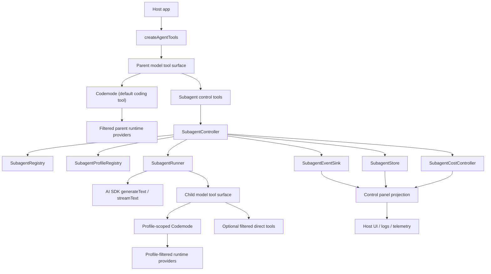
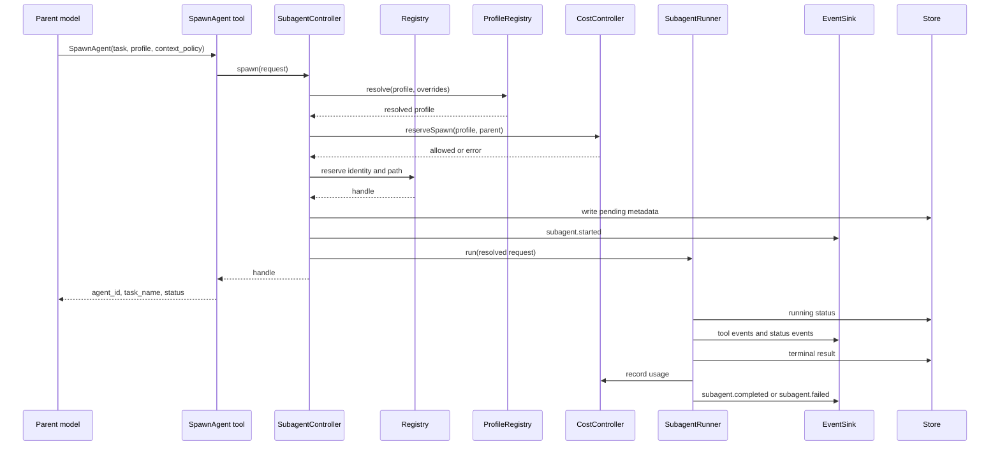
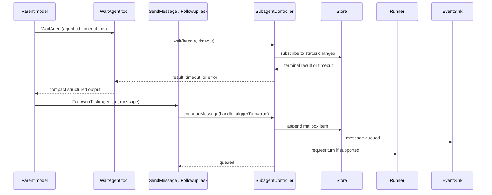
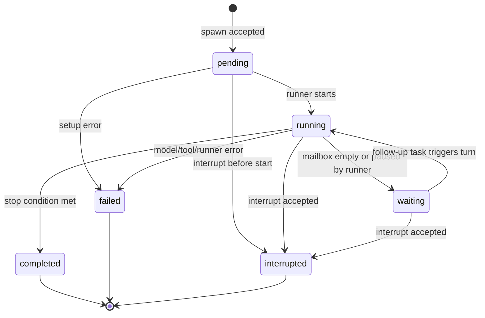
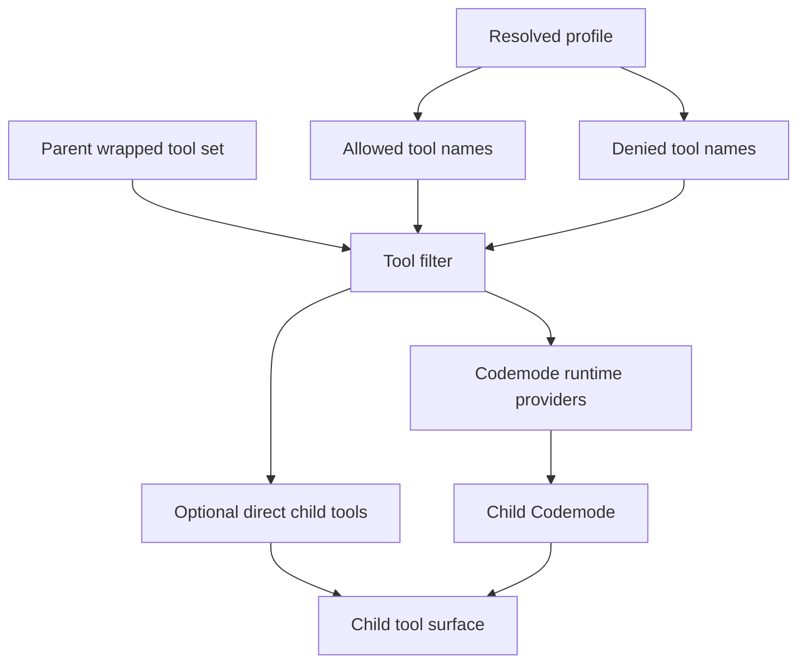
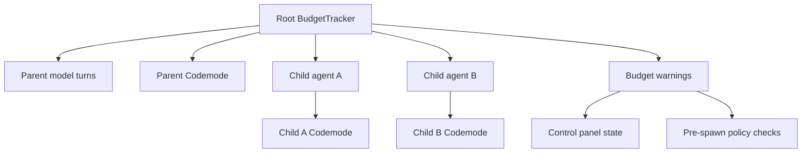

# feat: Make Codemode and subagents the default agent model

## Summary

This plan makes BashKit a Codemode-first, subagent-first agent framework. The breaking release replaces the current direct-tool default and blocking `Task` delegation pattern with a reusable subagent control plane, profile-scoped Codemode execution, typed lifecycle events, shared cost controls, and host-facing control panel state.

The design borrows Codex's core shape: tools are thin adapters, orchestration lives in a controller, agent identities are stable and addressable, role/profile resolution is configuration-driven, and parent agents supervise child agents through explicit control tools.

---

## Problem Frame

BashKit already has the ingredients for an agentic coding toolkit: sandbox tools, context layers, budget tracking, skills, Codemode integration, and a `Task` tool that can run a child model call. The current default shape still centers direct tool exposure. A parent model receives individual tools such as `Bash`, `Read`, `Write`, and `Edit`, and `Task` behaves like a one-shot nested generation that returns text.

That model is too small for dynamic workflows and serious subagent orchestration. It lacks:

- Stable child identity that survives beyond one tool call.
- A registry for listing, addressing, and supervising agents.
- Non-blocking spawn/wait/message/interrupt controls.
- Profile configuration that changes model, tools, Codemode access, budget, context, and callbacks together.
- A cost policy that understands parent Codemode, child Codemode, nested generations, concurrency, and spawn depth as one shared budget domain.
- A host-facing state projection for control panels.
- A disciplined way to keep full child transcripts out of the parent model context.

Codex has already solved the architectural split. Its multi-agent tools do not own orchestration. `AgentControl`, `AgentRegistry`, role resolution, path-like names, execution limits, lifecycle notifications, and status subscriptions form the actual control plane. BashKit should implement that idea in TypeScript and AI SDK terms, without importing Codex's Rust runtime, TUI assumptions, rollout storage, or cloud task APIs.

---

## Goals

- Make Codemode the default model-facing coding harness.
- Make first-class subagent controls the default delegation interface.
- Preserve direct BashKit tools as runtime providers and explicit compatibility mode, not the normal public surface.
- Build a reusable `src/subagents/` architecture that library consumers can use directly without model-visible tools.
- Keep subagent execution safe through profile quarantine, shared cost controls, depth limits, concurrency limits, and bounded context inheritance.
- Expose typed state and events so hosts can build control panels without depending on internal controller objects.
- Provide a breaking migration story from `Task` and direct tool exposure.

## Non-Goals

- Do not add subagent concepts to the `Sandbox` interface.
- Do not ship a bundled React/Vue/Svelte control panel.
- Do not implement durable resume of active JavaScript execution in this milestone.
- Do not build a full dynamic workflow authoring system in this milestone.
- Do not require BashKit to own Codex-style terminal UI, rollout storage, or thread manager behavior.

---

## Requirements

**Breaking API Direction**

- R1. Make Codemode the default way models perform coding work through BashKit when a Codemode executor is configured.
- R2. Make the breaking change explicit in versioning, migration docs, and release notes.
- R3. Replace `Task` as the primary subagent API with first-class subagent control tools and controller APIs.
- R4. Keep tool failures model-visible as `{ error: string }` results, except for construction-time configuration errors.
- R5. Use nullable tool input fields for optional parameters so OpenAI structured outputs remain compatible.
- R6. Keep direct tool exposure available only as explicit compatibility or advanced configuration.

**Subagent Foundation**

- R7. Add stable subagent identity with generated IDs, optional path-like task names, profile type, status, parent/child relationship, and last task message.
- R8. Introduce a profile registry that resolves built-in, inline, and file-loaded profiles into model, prompt, tools, Codemode policy, context policy, cost policy, stop conditions, callbacks, and metadata.
- R9. Centralize spawn-time runtime inheritance so children receive the intended model, wrapped tools, budget tracker, context layers, prepare-step behavior, and Codemode harness.
- R10. Provide non-blocking tools for spawning, listing, waiting, messaging, follow-up tasks, and interrupting subagents.
- R11. Maintain UI/event visibility for subagent activity without forcing full child transcripts into parent model context.
- R12. Enforce cost controls across parent Codemode, child runs, nested Codemode calls, and parallel child executions.
- R13. Use Codemode as the default orchestration tool inside subagents, with profile-level quarantine applied to Codemode runtime providers.
- R14. Provide a parent-agent control surface that exposes live state, supervision actions, budget usage, warnings, and concise activity history to host UIs.
- R15. Support lifecycle hooks for subagent start, stop, completion, failure, interruption, message delivery, and follow-up delivery.
- R16. Support controlled context inheritance so spawn can receive no parent context, full parent context, or a bounded recent-turn window.
- R17. Document the new architecture and update examples around the Codemode-first, subagent-first API.

**Workflow Readiness**

- R18. Make the controller usable by future workflow harnesses that fan out work, synthesize results, adversarially verify outputs, loop until done, or route models.
- R19. Provide persistence boundaries for subagent metadata and terminal results, while deferring active-process resume unless the host supplies a durable runner.
- R20. Support quarantine-style tool scoping so low-trust agents can be restricted from high-privilege write, shell, and subagent-control tools.
- R21. Keep the implementation fully typed with no new `any` in public or internal subagent contracts.
- R22. Add explicit completion semantics so child agents terminate by status transition or stop condition rather than heuristic parent-side guessing.
- R23. Keep every host-visible state snapshot serializable as plain JSON.
- R24. Preserve context-layer and cache behavior by inheriting already-wrapped tools unless a profile narrows them.

---

## Design Principles

- **Unified orchestrator, varied profiles:** All subagents run through one controller and runner contract. Profiles vary the model, prompt, allowed tools, Codemode policy, context policy, budget cap, and callbacks.
- **Tools are primitives, not workflows:** `SpawnAgent`, `WaitAgent`, `SendMessage`, and `InterruptAgent` are atomic controls. Fan-out, tournament, verification, and loop-until-done patterns are composed by prompts or host workflow code.
- **Agent and UI share state:** The controller emits events and snapshots that host UIs can observe. The UI should not scrape model text to understand agent state.
- **Context is a budgeted resource:** Parent history should not silently flood every child. Spawn calls make context inheritance explicit.
- **Quarantine is structural:** A restricted profile must not regain blocked tools through Codemode's runtime providers, direct tool exposure, recursive subagents, or extra tools.
- **Completion is explicit:** The controller records terminal states and completion events. Parent agents should not infer completion from absence of tool calls.
- **Library boundaries stay clean:** Sandboxes execute commands and file IO. Subagents orchestrate model/tool execution. Host apps render UI.

---

## Key Technical Decisions

- KTD1. Split subagent core from tool adapters: create `src/subagents/` for profiles, identity, registry, controller, stores, events, state projections, policies, and runner contracts. Tool files call into this module.
- KTD2. Make Codemode the default public harness: `createAgentTools` exposes a Codemode tool by default when a Codemode executor is supplied. Direct tools are runtime providers and optional compatibility exposure.
- KTD3. Make subagent controls the default delegation API: expose `SpawnAgent`, `ListAgents`, `SendMessage`, `FollowupTask`, `WaitAgent`, and `InterruptAgent` for parent model coordination.
- KTD4. Remove `Task` entirely in the breaking release: the one-shot delegation abstraction does not fit the controller-managed subagent model. Migrate callers to `SpawnAgent` plus `WaitAgent`.
- KTD5. Put Codemode inside subagents by default: children receive a profile-scoped Codemode tool that can orchestrate only the tools allowed by the profile.
- KTD6. Apply quarantine at two layers: profile allowlists filter direct tools and Codemode runtime providers. A restricted profile cannot regain `Write`, `Edit`, `Patch`, `Bash`, `SpawnAgent`, or `FollowupTask` through generated code.
- KTD7. Model profiles as runtime configuration, not prompt strings: profiles resolve to model, prompt, tool policy, Codemode policy, context policy, cost policy, stop conditions, prepare-step, callbacks, and host metadata.
- KTD8. Use in-memory orchestration first with host-extensible persistence: the default store tracks live promises and terminal records in memory. A `SubagentStore` interface lets hosts persist metadata and results.
- KTD9. Treat messaging as mailbox semantics: `SendMessage` queues input, `FollowupTask` queues input and requests a turn, and `WaitAgent` observes status/mailbox changes.
- KTD10. Inherit wrapped tools by default: child agents receive the same cache/context-wrapped tools as the parent unless narrowed. This preserves execution policy, output policy, and budget behavior.
- KTD11. Keep child transcripts out of parent context: parent-visible results include terminal summary, status, usage, and references. Full transcripts are available only through host callbacks, event sinks, or explicit transcript APIs.
- KTD12. Treat the control panel as a host projection: BashKit emits typed state snapshots and events, not a UI framework component.
- KTD13. Make cost control shared and preemptive: spawns and follow-ups are rejected before model calls when budget, depth, active count, total count, or timeout policy is exhausted.
- KTD14. Use path-like agent references: task names form stable paths addressable relative to the current parent, while generated IDs remain canonical for storage.
- KTD15. Add lifecycle hooks as extension points: hosts can observe, audit, enrich, or block lifecycle transitions without changing tool implementations.
- KTD16. Keep profile-visible descriptions generated from config: parent agents can route to the right profile because model-facing descriptions include profile purpose, allowed capabilities, locked model/cost settings, and quarantine constraints.
- KTD17. Do not require durable active-run resume in the default runner: the store persists terminal metadata and results, but active process recovery belongs to host-supplied durable runners.

---

## Codex Patterns to Borrow

| Codex pattern | BashKit adaptation | Why it matters |
| --- | --- | --- |
| Agent control plane | `SubagentController`, `SubagentRegistry`, `SubagentRunner`, `SubagentStore` | Keeps tools thin and makes the model-visible API stable. |
| Path-based identity | Optional `task_name` paths plus canonical generated IDs | Lets agents coordinate with readable names such as `research/auth`. |
| Role/config layering | `SubagentProfileRegistry` with layered defaults and overrides | Makes profile selection safer than ad hoc system prompts. |
| `fork_turns` context control | `none`, `all`, or bounded recent-turn context | Makes context cost explicit during fan-out. |
| Lifecycle hooks | `onStart`, `onStop`, `onComplete`, `onInterrupt`, `onMessage` | Enables audit, UI, policy, and telemetry without embedding UI concerns. |
| Completion notifications | Event sink and control panel updates independent of `WaitAgent` | Keeps supervision state current even when parent is doing other work. |
| Execution limits | Max active agents, total agents, depth, and per-profile caps | Prevents runaway recursion and local resource overload. |
| Role-visible descriptions | Generated profile summaries in tool descriptions and config helpers | Helps parent models route work without guessing. |

Do not copy Codex's Rust thread manager, TUI implementation, cloud task APIs, or rollout storage. BashKit should borrow the contracts and invariants, not the product shell.

---

## Codex Reference File Map

When implementing this plan, use these paths relative to a local Codex checkout. The file map is intentionally explicit because the BashKit implementation should borrow Codex's shape, not rediscover it from scratch.

### Read First

| Codex file | Reference purpose | BashKit design area |
| --- | --- | --- |
| `codex-rs/core/src/agent/control.rs` | Main control-plane contract for listing agents, sending input, interrupting, and waiting for completion | `SubagentController` public API and ownership boundaries |
| `codex-rs/core/src/agent/registry.rs` | Agent identity, path/name registration, reservations, and max-thread constraints | `SubagentRegistry`, path resolution, duplicate-name behavior |
| `codex-rs/core/src/agent/role.rs` | Role resolution, built-in roles, locked settings, model/tool visibility, and role metadata | `SubagentProfileRegistry` and generated profile descriptions |
| `codex-rs/core/src/tools/handlers/multi_agents_spec.rs` | Model-facing tool schemas and descriptions for multi-agent controls | BashKit control tool schemas and model-facing wording |
| `codex-rs/core/src/tools/handlers/multi_agents_v2.rs` | Tool registration and dispatch split for the newer multi-agent API | `src/tools/subagents/index.ts` and adapter boundaries |

### Control Plane Internals

| Codex file | Reference purpose | BashKit design area |
| --- | --- | --- |
| `codex-rs/core/src/agent/control/spawn.rs` | Spawn orchestration, role resolution, context forking, and child setup | `SubagentController.spawn` and `SubagentRunner` setup |
| `codex-rs/core/src/agent/control/execution.rs` | Active execution accounting and concurrency limiting | `SubagentExecutionPolicy` and pre-spawn rejection |
| `codex-rs/core/src/agent/control/residency.rs` | Residency and lifecycle tracking for active agents | Store boundary and active-vs-terminal metadata |
| `codex-rs/core/src/agent/status.rs` | Agent status representation and status updates | `SubagentStatus`, terminal states, control panel projection |
| `codex-rs/core/src/agent/agent_resolver.rs` | Resolving agent references from names and paths | `SubagentPath` parsing and relative lookup |
| `codex-rs/core/src/agent/agent_names.txt` | Human-readable generated agent names | Optional nickname generation and display metadata |

### Tool Adapter Split

| Codex file | Reference purpose | BashKit design area |
| --- | --- | --- |
| `codex-rs/core/src/tools/handlers/multi_agents_v2/spawn.rs` | Thin spawn tool adapter over the control plane | `SpawnAgent` adapter |
| `codex-rs/core/src/tools/handlers/multi_agents_v2/list_agents.rs` | Compact list output and status display | `ListAgents` output and control panel summaries |
| `codex-rs/core/src/tools/handlers/multi_agents_v2/wait.rs` | Bounded wait behavior and terminal result formatting | `WaitAgent` timeout and result shape |
| `codex-rs/core/src/tools/handlers/multi_agents_v2/send_message.rs` | Message delivery to an existing agent | `SendMessage` mailbox behavior |
| `codex-rs/core/src/tools/handlers/multi_agents_v2/followup_task.rs` | Follow-up task routing to a child agent | `FollowupTask` turn-triggering semantics |
| `codex-rs/core/src/tools/handlers/multi_agents_v2/interrupt_agent.rs` | Interrupt request behavior | `InterruptAgent` best-effort cancellation |
| `codex-rs/core/src/tools/handlers/multi_agents_v2/message_tool.rs` | Shared helper behavior for message-like tools | Shared message adapter utilities |

### Role and Profile Examples

| Codex file | Reference purpose | BashKit design area |
| --- | --- | --- |
| `codex-rs/core/src/agent/builtins/explorer.toml` | Built-in exploratory role configuration | BashKit `researcher` or `reviewer` profile defaults |
| `codex-rs/core/src/agent/builtins/awaiter.toml` | Built-in role with specific coordination behavior | BashKit specialized coordination profiles |
| `codex-rs/core/src/agent/role_tests.rs` | Role resolution edge cases | Profile registry tests |
| `codex-rs/core/src/agent/registry_tests.rs` | Registry reservations and path behavior | Registry and identity tests |
| `codex-rs/core/src/agent/control_tests.rs` | Control-plane behavior coverage | Controller tests with fake runners |

### Integration and Regression Tests

| Codex file | Reference purpose | BashKit design area |
| --- | --- | --- |
| `codex-rs/core/tests/suite/subagent_notifications.rs` | Parent notification when subagents finish | Completion events and control panel updates |
| `codex-rs/core/tests/suite/spawn_agent_description.rs` | Model-facing descriptions for spawnable agents | Generated profile descriptions |
| `codex-rs/core/tests/suite/agent_execution.rs` | Execution lifecycle and active execution behavior | Runner lifecycle and execution limits |
| `codex-rs/core/tests/suite/hierarchical_agents.rs` | Nested agents and parent/child relationships | Depth policy and hierarchical identity |
| `codex-rs/core/tests/suite/agent_jobs.rs` | Batch-style agent work | Future workflow harness inspiration, not first milestone scope |
| `codex-rs/core/tests/suite/agent_websocket.rs` | Event streaming and status visibility | Host event sink and UI state projection |

### Read Later or Treat as Non-Goals

| Codex file | Why it is secondary |
| --- | --- |
| `codex-rs/core/src/tools/handlers/multi_agents.rs` | Older multi-agent API; useful for migration comparison but not the target shape. |
| `codex-rs/core/src/tools/handlers/multi_agents_common.rs` | Shared older helpers; inspect only when porting a specific behavior. |
| `codex-rs/core/src/tools/handlers/agent_jobs.rs` | Batch agent jobs are useful workflow inspiration, but BashKit should first land the subagent foundation. |
| `codex-rs/core/src/tools/handlers/agent_jobs_spec.rs` | Same as above; do not let batch jobs expand the first milestone. |

Recommended implementation reading order: start with `control.rs`, `registry.rs`, `role.rs`, and `multi_agents_spec.rs`; then inspect the `multi_agents_v2/` adapters; then read the test files that correspond to the BashKit unit being implemented.

---

## Architecture Overview



The parent receives Codemode as the normal way to perform coding work and subagent controls as the normal way to delegate. `createAgentTools` creates a controller when `subagents` config is present. Tool adapters validate nullable schemas, call the controller, and return compact structured results. The controller resolves profiles, reserves identities, checks cost/execution policy, starts runner work, records status, and emits events.

---

## Runtime Flow

### Spawn and Completion Sequence



### Wait and Message Sequence



---

## State Model

### Subagent Status State Machine



Terminal states are `completed`, `failed`, and `interrupted`. `waiting` is non-terminal and means the agent exists, has context/state, and can receive follow-up work if the runner supports it. If the default AI SDK runner cannot maintain a paused live conversation safely, it may treat every run as terminal after one task and return an unsupported error for follow-up turns. The controller contract should still model `waiting` so durable runners and future workflow harnesses have the right shape.

### Identity Model

Each subagent has two identifiers:

- `agent_id`: generated, unique, stable, and canonical for storage.
- `task_name`: optional model-facing path such as `research/auth`, `verify/security`, or `fix/tests`.

Path resolution should support:

- Exact current-tree lookup by `task_name`.
- Relative child lookup from the current parent.
- Sibling lookup when the caller is a child and names a sibling.
- Generated ID lookup as the unambiguous fallback.

Duplicate live paths under the same root should return `{ error }`. Terminal paths may be reusable only if the controller policy allows it. The default should reject duplicate live paths and allow explicit reuse only through config.

---

## Public API Shape

The following sketches are directional contracts, not final implementation code.

### Factory Configuration

```ts
export interface AgentConfig {
  codemode?: CodemodeConfig;
  subagents?: SubagentConfig;
  exposeDirectTools?: boolean | DirectToolExposureConfig;
  budget?: BudgetConfig;
  context?: ContextConfig;
}

export interface SubagentConfig {
  model?: LanguageModel;
  profiles?: SubagentProfileInput[];
  defaultProfile?: string;
  codemode?: SubagentCodemodeConfig;
  store?: SubagentStore;
  eventSink?: SubagentEventSink;
  cost?: SubagentCostPolicyInput;
  contextInheritance?: SubagentContextPolicyInput;
  lifecycle?: SubagentLifecycleHooks;
  exposeControlTools?: boolean;
  legacyTask?: false | "deprecated-adapter";
}
```

Default behavior:

- If `codemode` is configured, expose Codemode as the primary coding tool.
- If `subagents` is configured, expose subagent control tools.
- Direct tools are hidden from the parent unless `exposeDirectTools` is configured.
- Direct tools remain available as Codemode runtime providers after safety filtering.
- Child Codemode receives profile-filtered runtime providers.

### Core Controller

```ts
export interface SubagentController {
  spawn(request: SubagentSpawnRequest): Promise<SubagentHandle | SubagentError>;
  list(filter?: SubagentListFilter): Promise<SubagentMetadata[]>;
  wait(request: SubagentWaitRequest): Promise<SubagentWaitResult | SubagentError>;
  sendMessage(request: SubagentMessageRequest): Promise<SubagentMessageResult | SubagentError>;
  followupTask(request: SubagentFollowupRequest): Promise<SubagentMessageResult | SubagentError>;
  interrupt(request: SubagentInterruptRequest): Promise<SubagentInterruptResult | SubagentError>;
  snapshot(): Promise<SubagentControlPanelState>;
}
```

The controller owns identity, status, policy checks, hooks, events, and persistence writes. Runners execute resolved work. Stores persist metadata and terminal outputs. Tool adapters should contain no orchestration logic beyond schema defaults and result formatting.

### Runner Contract

```ts
export interface SubagentRunner {
  capabilities: SubagentRunnerCapabilities;
  run(request: ResolvedSubagentRunRequest): Promise<SubagentRunResult>;
  interrupt?(handle: SubagentHandle): Promise<SubagentInterruptResult | SubagentError>;
  requestTurn?(handle: SubagentHandle): Promise<SubagentMessageResult | SubagentError>;
}
```

The default runner should use AI SDK `generateText` or `streamText` and be easy to fake in tests. A future durable runner can implement `requestTurn`, checkpointing, and active-run resume without changing tool schemas.

### Store Contract

```ts
export interface SubagentStore {
  create(metadata: SubagentMetadata): Promise<void>;
  update(handle: SubagentHandle, patch: SubagentMetadataPatch): Promise<void>;
  appendEvent(event: SubagentEvent): Promise<void>;
  appendMessage(handle: SubagentHandle, message: SubagentMailboxMessage): Promise<void>;
  get(handle: SubagentHandle): Promise<SubagentRecord | null>;
  list(filter?: SubagentListFilter): Promise<SubagentRecord[]>;
}
```

The default `InMemorySubagentStore` keeps live records and terminal results. Host stores can persist metadata, compact terminal results, event references, and transcript references. Stores should not need to persist model instances or executable functions.

---

## Tool Surface

### Parent Model Tools

| Tool | Purpose | Blocking behavior | Returns |
| --- | --- | --- | --- |
| `Codemode` | Default coding harness | Runs until Codemode completes | Codemode result or `{ error }` |
| `SpawnAgent` | Start a child agent | Non-blocking after reservation | Handle, path, status, profile metadata |
| `ListAgents` | Inspect active and terminal agents | Immediate | Compact records and supported actions |
| `WaitAgent` | Await status/result changes | Bounded by timeout policy | Terminal result, status update, or timeout |
| `SendMessage` | Queue information for an agent | Immediate | Queued result |
| `FollowupTask` | Queue work and request a turn | Immediate unless runner rejects | Queued/triggered result |
| `InterruptAgent` | Request cancellation | Immediate best effort | Previous status and new status |

### Tool Schema Rules

- Optional inputs use `.nullable()`, not `.optional()`.
- Tool outputs return structured objects, not prose-only strings.
- Errors return `{ error: string }` plus optional typed metadata where useful.
- `WaitAgent` timeouts must be bounded by config.
- `SpawnAgent` must reject empty task prompts.
- `FollowupTask` must reject self-targeting that could deadlock the current agent.
- Tool descriptions must warn against unnecessary fan-out and recursive spawning.

### Proposed Tool Inputs

| Tool | Key inputs |
| --- | --- |
| `SpawnAgent` | `task`, `profile`, `task_name`, `context`, `tools`, `model`, `budget`, `metadata` |
| `ListAgents` | `status`, `path_prefix`, `include_terminal`, `limit` |
| `WaitAgent` | `agent`, `timeout_ms`, `until_status` |
| `SendMessage` | `agent`, `message`, `metadata` |
| `FollowupTask` | `agent`, `task`, `context`, `metadata` |
| `InterruptAgent` | `agent`, `reason` |

The final implementation can add fields, but the first version should avoid fields that imply durable active-run resume unless the default runner supports them.

---

## Profile System

Profiles are the safety and specialization boundary. They should be layered in this order:

1. Built-in BashKit defaults.
2. Host-level subagent defaults.
3. Named profile config.
4. Spawn-time overrides allowed by policy.

### Profile Shape

```ts
export interface SubagentProfile {
  name: string;
  description: string;
  nickname?: string;
  model?: LanguageModel;
  system?: string;
  allowedTools?: string[];
  deniedTools?: string[];
  codemode?: SubagentCodemodePolicy;
  context?: SubagentContextPolicy;
  cost?: SubagentCostPolicyInput;
  stopWhen?: StopCondition[];
  prepareStep?: PrepareStepCallback;
  lifecycle?: SubagentLifecycleHooks;
  metadata?: JsonObject;
}
```

### Built-In Profiles

| Profile | Intended use | Default tools | Notes |
| --- | --- | --- | --- |
| `worker` | General implementation or investigation | Codemode with normal safe providers | Default child profile. |
| `researcher` | Read-only exploration and synthesis | Read/search/list tools, no writes or shell by default | Good for fan-out and adversarial review. |
| `reviewer` | Critique, verification, test design | Read/search/list tools, optional test command through guarded Codemode | Should be isolated from write tools by default. |
| `fixer` | Focused code changes | Codemode with write/patch/test tools | Should usually have tighter budget and depth caps. |
| `summarizer` | Compact transcripts and terminal results | Read-only tools or no tools | Useful for keeping parent context small. |

Built-ins should be conservative. Hosts can add broader profiles for trusted environments.

### Quarantine Rules



Quarantine must be applied after context/cache/budget wrapping and before child exposure. This prevents a restricted child from using unwrapped tools or wider Codemode providers.

Default denied tools for low-trust profiles should include `Write`, `Edit`, `Patch`, `Bash`, `SpawnAgent`, `FollowupTask`, and any tool that can mutate external state. Hosts can opt into wider access when they understand the risk.

---

## Context Inheritance

Context inheritance is a first-class spawn policy:

| Policy | Behavior | Use case |
| --- | --- | --- |
| `none` | Child receives only task, profile prompt, static system context, and injected metadata | Cheap, isolated research or verification. |
| `{ recent_turns: n }` | Child receives the last `n` parent turns plus task | Default for most delegated work. |
| `all` | Child receives all eligible parent context | Rare, expensive, useful when precise continuity matters. |

The controller should also support `context_summary` as host-supplied compact context. It should not summarize implicitly in the first milestone unless an explicit summarizer profile or callback is configured.

Context inheritance should exclude:

- Full child transcripts from sibling agents.
- Host-only secrets.
- Tool outputs that a context layer already redacted.
- Internal budget telemetry unless the profile asks for it.

---

## Cost and Execution Control

### Cost Domains



All model usage should report into the same root budget tracker by default. Per-profile caps can stop a child early without terminating the whole root run unless the root budget is exhausted.

### Guardrail Policy

| Limit | Default posture | Failure mode |
| --- | --- | --- |
| Max active agents | Conservative configurable default | `SpawnAgent` returns `{ error }`. |
| Max total agents per root run | Configurable | Spawn rejected once exhausted. |
| Max depth | Default 1 or 2 | Nested spawn rejected. |
| Per-agent budget cap | Optional profile cap | Child stops with budget status. |
| Root budget cap | Existing budget config | Parent and children stop using same tracker. |
| Wait timeout bounds | Required min/max | `WaitAgent` clamps or rejects. |
| Max mailbox length | Configurable | Messages rejected before unbounded growth. |

Cost policy should run before expensive work. If budget is already exhausted, `SpawnAgent` should fail before reserving a runner. If active count is exhausted, the controller should avoid starting work and should release any tentative reservation.

---

## Lifecycle Hooks and Events

### Hook Contract

Lifecycle hooks let host apps observe or shape behavior without forking tools:

- `onBeforeSpawn`: inspect request, inject metadata, or return `{ error }`.
- `onStart`: observe accepted handle and resolved profile.
- `onMessage`: observe queued messages and follow-up tasks.
- `onToolEvent`: observe child tool activity.
- `onComplete`: observe terminal successful result.
- `onFail`: observe terminal failure.
- `onInterrupt`: observe interrupt requests and results.
- `onStop`: observe all terminal transitions.

Hooks should be typed, async, and isolated from tool adapter code. Hook failures should be policy-driven:

- Blocking hooks such as `onBeforeSpawn` may return `{ error }`.
- Observability hooks should emit errors to debug/event channels without changing child status unless configured.

### Event Types

| Event | Emitted when | Host use |
| --- | --- | --- |
| `subagent.created` | Identity reserved | Add row to control panel. |
| `subagent.started` | Runner begins | Mark active. |
| `subagent.status_changed` | Status changes | Update UI and subscriptions. |
| `subagent.message_queued` | Message/follow-up queued | Show pending work. |
| `subagent.tool_call` | Child tool starts | Activity timeline. |
| `subagent.tool_result` | Child tool completes | Activity timeline and debugging. |
| `subagent.usage` | Usage reported | Budget panel. |
| `subagent.completed` | Successful terminal state | Show result reference. |
| `subagent.failed` | Error terminal state | Show error. |
| `subagent.interrupted` | Interrupt terminal state | Show reason. |

Events should contain `agent_id`, `task_name`, `parent_id`, `profile`, `status`, timestamp, and compact payload. They must avoid full transcript inclusion by default.

---

## Control Panel State

The control panel is a serializable projection, not a UI component.

```ts
export interface SubagentControlPanelState {
  root_id: string;
  generated_at: string;
  budget: SubagentBudgetSummary | null;
  warnings: SubagentWarning[];
  agents: SubagentControlPanelAgent[];
  activity: SubagentActivityItem[];
}
```

Each agent row should include:

- `agent_id`
- `task_name`
- `profile`
- `nickname`
- `status`
- `parent_id`
- `depth`
- `last_task_message`
- `created_at`
- `updated_at`
- `usage`
- `supported_actions`
- `result_ref`
- `transcript_ref`
- `warnings`

Supported actions are computed from status, runner capabilities, and policy:

| Status | Actions |
| --- | --- |
| `pending` | `interrupt` when supported |
| `running` | `message`, `followup`, `interrupt`, `wait` |
| `waiting` | `message`, `followup`, `interrupt`, `wait` |
| `completed` | `wait`, `inspect_result` |
| `failed` | `wait`, `inspect_result` |
| `interrupted` | `wait`, `inspect_result` |

The state projection should be JSON-serializable and stable enough for docs, devtools, logs, and host UIs.

---

## Persistence and Resume Boundary

The first implementation should persist:

- Subagent metadata.
- Status transitions.
- Mailbox items.
- Compact terminal results.
- Usage summaries.
- Event records or event references.
- Transcript references when the host supplies transcript storage.

The first implementation should not promise:

- Restarting a live AI SDK generation after Node process termination.
- Rehydrating live `LanguageModel` instances from serialized profile files.
- Replaying in-flight Codemode execution.

This boundary should be documented as "metadata and terminal result persistence" rather than "durable active-run resume." Future durable runners can add checkpoint/restore behind the same controller contracts.

---

## Migration Strategy

### Breaking Defaults

| Current behavior | New behavior |
| --- | --- |
| Direct tools are parent-visible by default | Codemode is parent-visible by default when configured |
| `Task` is the main delegation tool | Subagent controls are the main delegation tools |
| Child execution is one nested generation | Child execution is controller-managed |
| Cost tracking exists mostly at tool/generation boundaries | Cost tracking is shared across parent and children |
| UI receives optional `data-subagent` events from `Task` | UI can consume typed controller events and snapshots |

### Removed Legacy Tools

- Remove `Task` entirely in the breaking release. The one-shot nested generation model conflicts with stable subagent identity, lifecycle events, control panel state, messaging, waiting, interruption, and profile-scoped Codemode policy.
- Remove `TodoWrite` entirely in the breaking release. `UpdatePlan` is the canonical Codex-style progress primitive and emits normalized `plan.updated` runtime events for host UIs.
- Provide migration recipes: `Task(description, prompt)` becomes `SpawnAgent(task, task_name?)` then `WaitAgent(agent_id)`. `TodoWrite(todos)` becomes `UpdatePlan(plan)`.

### Versioning

BashKit is currently pre-1.0, but the contributor guide says breaking changes require a major bump. The implementation should either ship as `1.0.0` or explicitly document the pre-1.0 breaking version policy. Because this change redefines the default tool surface, `1.0.0` is the cleaner signal.

---

## Implementation Units

### U1. Create the Subagent Core Module

- **Goal:** Add foundational subagent types, identity, profile resolution, path handling, and tool filtering.
- **Requirements:** R7, R8, R9, R16, R20, R21, R24
- **Dependencies:** None
- **Files:** `src/subagents/AGENTS.md`, `src/subagents/CLAUDE.md`, `src/subagents/index.ts`, `src/subagents/types.ts`, `src/subagents/identity.ts`, `src/subagents/path.ts`, `src/subagents/profiles.ts`, `src/subagents/profile-descriptions.ts`, `src/subagents/tool-filter.ts`, `src/subagents/registry.ts`, `src/tools/AGENTS.md`, `src/index.ts`, `tests/subagents/identity.test.ts`, `tests/subagents/path.test.ts`, `tests/subagents/profiles.test.ts`, `tests/subagents/tool-filter.test.ts`, `tests/subagents/registry.test.ts`
- **Approach:** Define public-but-small interfaces for `SubagentProfile`, `ResolvedSubagentProfile`, `SubagentMetadata`, `SubagentStatus`, `SubagentPath`, `SubagentRunResult`, `SubagentCodemodePolicy`, `SubagentContextPolicy`, and `SubagentError`. Keep core request types separate from AI SDK tool schemas. Add path parsing, relative lookup, duplicate live-name checks, and profile-visible description generation.
- **Patterns to follow:** `src/tools/patch/` for promoting non-trivial internals into a folder; `src/tools/AGENTS.md` for documentation expectations; AI SDK runner tests for model/tool execution conventions.
- **Test scenarios:** Unique IDs are generated; duplicate live paths return `{ error }`; relative child and sibling paths resolve; terminal path reuse follows policy; profile resolution applies defaults, named profile config, and allowed overrides; profile descriptions include purpose, locked model/cost hints, and capability limits; tool filtering excludes unknown tools without throwing; Codemode policy inherits the same allowlist as direct tools; context policy accepts `none`, `all`, and recent-turn modes; optional nullable fields resolve with `??` defaults.
- **Verification:** `src/subagents/` exports only stable types/helpers and every new file is covered by `src/subagents/AGENTS.md`.

### U2. Add Controller, Store, Runner, and Event Contracts

- **Goal:** Introduce the runtime control plane for spawn, list, wait, message, follow-up, interrupt, lifecycle hooks, status transitions, and event emission.
- **Requirements:** R8, R9, R10, R11, R12, R14, R15, R16, R19, R22, R23
- **Dependencies:** U1
- **Files:** `src/subagents/controller.ts`, `src/subagents/store.ts`, `src/subagents/runner.ts`, `src/subagents/events.ts`, `src/subagents/status.ts`, `src/subagents/mailbox.ts`, `tests/subagents/controller.test.ts`, `tests/subagents/store.test.ts`, `tests/subagents/runner.test.ts`, `tests/subagents/events.test.ts`
- **Approach:** Implement `SubagentController` over `SubagentStore`, `SubagentRunner`, lifecycle hooks, and `SubagentEventSink`. Provide `InMemorySubagentStore` and an AI SDK runner. The controller owns reservations, status transitions, context inheritance, mailbox writes, completion notifications, and event ordering. The runner executes resolved runs and reports usage/events back through typed callbacks.
- **Patterns to follow:** Codex `AgentControl` and `AgentRegistry`; BashKit `BudgetTracker` stopWhen/onStepFinish composition in `src/subagents/ai-sdk-runner.ts`; debug parent attribution in `src/utils/debug.ts`.
- **Test scenarios:** Spawn moves `pending -> running -> completed`; setup failures move to `failed`; lifecycle hooks fire in deterministic order; completion notification emits even when no one waits; runner rejection records errored status and returns `{ error }`; interrupt changes status and aborts when supported; unsupported interrupt returns `{ error }`; wait timeout does not change status; mailbox updates `last_task_message`; follow-up requests a turn only when runner supports it; snapshots are JSON-serializable; fake runners can test behavior without real models.
- **Verification:** Controller tests use fake stores and fake runners; no live AI SDK calls are needed.

### U3. Add Shared Cost and Execution Guardrails

- **Goal:** Enforce cost, depth, concurrency, total count, mailbox, and wait limits before work fans out.
- **Requirements:** R12, R14, R18, R19, R22
- **Dependencies:** U1, U2
- **Files:** `src/subagents/cost-control.ts`, `src/subagents/execution-limits.ts`, `src/subagents/controller.ts`, `src/subagents/types.ts`, `src/utils/budget-tracking.ts`, `tests/subagents/cost-control.test.ts`, `tests/subagents/execution-limits.test.ts`, `tests/tools/budget-integration.test.ts`
- **Approach:** Add `SubagentCostPolicy` and `SubagentExecutionPolicy`. Compose existing `BudgetTracker` with subagent-specific limits: max active agents, max total agents per root run, max depth, per-profile budget caps, wait timeout bounds, mailbox length, and optional step caps. Check policy before spawn and follow-up. Report parent Codemode and child usage into the same tracker.
- **Patterns to follow:** Existing budget tracker `stopWhen` and `onStepFinish`; Codex active execution limiter; Codex spawn depth checks.
- **Test scenarios:** Spawn is rejected when root budget is exceeded; spawn is rejected at max active agents; nested spawn is rejected past max depth; total spawned count cannot exceed policy; child usage increments shared budget; parent Codemode and children appear in one budget status; per-profile caps stop expensive agents; wait timeout bounds prevent tight polling; mailbox limits reject unbounded queued work.
- **Verification:** Guardrails are tested with fake runners and fake usage records.

### U4. Implement Subagent Control Tools

- **Goal:** Add model-facing tools for multi-agent orchestration as the canonical delegation surface.
- **Requirements:** R3, R5, R7, R10, R11, R14, R20, R21, R22
- **Dependencies:** U1, U2, U3
- **Files:** `src/tools/subagents/AGENTS.md`, `src/tools/subagents/CLAUDE.md`, `src/tools/subagents/index.ts`, `src/tools/subagents/spawn-agent.ts`, `src/tools/subagents/list-agents.ts`, `src/tools/subagents/send-message.ts`, `src/tools/subagents/followup-task.ts`, `src/tools/subagents/wait-agent.ts`, `src/tools/subagents/interrupt-agent.ts`, `tests/tools/subagents/spawn-agent.test.ts`, `tests/tools/subagents/list-agents.test.ts`, `tests/tools/subagents/message-tools.test.ts`, `tests/tools/subagents/wait-agent.test.ts`, `tests/tools/subagents/interrupt-agent.test.ts`
- **Approach:** Keep each adapter thin: parse nullable input, apply `??` defaults, call the controller, and return compact structured output. Tool descriptions should teach models that subagents are for separable work and warn against redundant fan-out.
- **Patterns to follow:** Codex multi-agent tool split; BashKit tool factories returning `Tool<Input, Output | Error>`; nullable schema convention in `src/tools/AGENTS.md`.
- **Test scenarios:** `SpawnAgent` rejects empty tasks; duplicate `task_name` returns `{ error }`; `ListAgents` filters by status and path prefix; `SendMessage` accepts valid IDs and paths; `FollowupTask` rejects self-targeting deadlock cases; `WaitAgent` enforces timeout policy; `InterruptAgent` returns previous and new status; every optional schema field is nullable; tool outputs are stable structured objects.
- **Verification:** Tool tests assert structured results and do not require live model execution.

### U5. Implement the Default AI SDK Runner

- **Goal:** Provide the default execution backend for subagents using AI SDK generation and profile-scoped Codemode.
- **Requirements:** R9, R11, R12, R13, R16, R20, R22, R24
- **Dependencies:** U1, U2, U3
- **Files:** `src/subagents/ai-sdk-runner.ts`, `src/subagents/tool-surface.ts`, `src/subagents/context-inheritance.ts`, `src/subagents/transcripts.ts`, `tests/subagents/ai-sdk-runner.test.ts`, `tests/subagents/context-inheritance.test.ts`, `tests/subagents/tool-surface.test.ts`
- **Approach:** Construct a child tool surface from the resolved profile. Build Codemode providers after profile filtering. Include optional direct tools only when the profile asks for them. Apply context inheritance before the model call. Route usage, tool events, and terminal summaries back through runner callbacks.
- **Patterns to follow:** `src/subagents/ai-sdk-runner.ts` AI SDK generation flow; `src/tools/codemode.ts` provider selection and `selectCodemodeTools`; `src/context/index.ts` wrapping behavior.
- **Test scenarios:** Child receives Codemode by default; child direct tools are hidden unless profile opts in; blocked tools are absent from Codemode providers; recent-turn context includes only the configured number of turns; `none` context excludes parent history; runner reports usage to the controller; generated terminal summary excludes full transcript; stop conditions produce `completed`; model/tool failure produces `failed` with `{ error }`.
- **Verification:** Runner tests use mock models/tools where possible and avoid networked model calls.

### U6. Remove Legacy `Task` and `TodoWrite`

- **Goal:** Make the breaking delegation/progress decision explicit by deleting old model-facing compatibility tools.
- **Requirements:** R1, R2, R3, R4, R5, R8, R10, R11, R13
- **Dependencies:** U1, U2, U3, U5
- **Files:** `src/tools/task.ts`, `src/tools/todo-write.ts`, `src/tools/index.ts`, `src/index.ts`, `tests/tools/todo-write.test.ts`, `tests/tools/budget-integration.test.ts`, `README.md`, docs pages
- **Approach:** Delete `Task` and `TodoWrite` factories/types/tests/exports. Keep `UpdatePlan` as the canonical progress tool and subagent controls as the canonical delegation API. Move useful budget and event assertions into controller/runtime tests rather than preserving adapter behavior.
- **Patterns to follow:** `UpdatePlan` runtime event behavior; subagent control tool tests; `createAgentTools` export surface tests.
- **Test scenarios:** `Task` and `TodoWrite` are absent from package exports; `UpdatePlan` remains default; budget tests no longer import legacy tools; docs/examples contain migration wording instead of legacy usage examples.
- **Verification:** New docs do not teach `Task` or `TodoWrite` as supported APIs.

### U7. Add Parent-Agent Control Panel State

- **Goal:** Expose typed host-facing state for supervising subagents from the parent session.
- **Requirements:** R10, R11, R12, R14, R19, R23
- **Dependencies:** U1, U2, U3, U4, U6
- **Files:** `src/subagents/control-panel.ts`, `src/subagents/events.ts`, `src/subagents/index.ts`, `tests/subagents/control-panel.test.ts`, `README.md`, `docs/src/app/tools/page.tsx`
- **Approach:** Add a projection layer that turns controller state, store records, events, and budget summaries into `SubagentControlPanelState`. Include live and terminal agents, status, profile/type, resolved model summary, task name, nickname, last task message, parent/child relationship, budget summary, warnings, supported actions, and transcript/result references.
- **Patterns to follow:** Codex `list_agents` status output; BashKit budget status shape in `src/utils/budget-tracking.ts`; normalized runtime event snapshots.
- **Test scenarios:** Starting a child adds it to active state; completion moves it to terminal state without dropping result references; budget updates and warnings appear; unsupported actions are absent; full transcript text is excluded by default; snapshots serialize to plain JSON; path filters produce stable subsets.
- **Verification:** Host apps can build a control panel without reaching into controller internals.

### U8. Make Codemode and Subagents the Default Factory Surface

- **Goal:** Change BashKit's factory and package surface to Codemode-first and subagent-first defaults.
- **Requirements:** R1, R2, R6, R8, R9, R10, R12, R13, R15, R16, R21, R24
- **Dependencies:** U1, U2, U3, U4, U5, U6, U7
- **Files:** `src/types.ts`, `src/tools/index.ts`, `src/index.ts`, `tests/tools/index.test.ts`, `tests/context/integration.test.ts`
- **Approach:** Reshape `createAgentTools` so Codemode config creates a Codemode-first surface. Direct tools remain as Codemode runtime providers and explicit compatibility exposure through `directTools: "legacy"`. Add top-level `subagents` config for model defaults, profiles, limits, store, event sink, lifecycle hooks, context policy, and Codemode executor/config. Pass already-wrapped tools into Codemode and the controller.
- **Patterns to follow:** Config-presence pattern for `webSearch`, `webFetch`, `skill`, `codemode`, and `budget`; `context.extraTools` wrapping order in `src/tools/index.ts`; `selectCodemodeTools` safety filtering in `src/tools/codemode.ts`.
- **Test scenarios:** Codemode config creates Codemode-first parent surface; direct tool exposure requires explicit compatibility config; `subagents` creates control tools; missing model/executor returns clear construction error; context-wrapped tools are inherited; budget enters the controller; max concurrent agents rejects excess spawns; profile restrictions apply to direct tools and Codemode providers; exported types are available from `src/index.ts`.
- **Verification:** Factory tests describe Codemode-default, subagent-default, context-layer, profile-restricted Codemode, and legacy-adapter cases.

### U9. Add Profile Loading Helpers

- **Goal:** Provide a shareable profile format for team-standard subagent definitions and future workflow templates.
- **Requirements:** R8, R13, R17, R18, R20, R21
- **Dependencies:** U1, U8
- **Files:** `src/subagents/profile-loader.ts`, `src/subagents/profile-loader.schema.ts`, `tests/subagents/profile-loader.test.ts`, `README.md`, `docs/src/app/tools/page.tsx`
- **Approach:** Add explicit helpers for loading JSON profile files from a sandbox or local filesystem abstraction. Validate with Zod. Keep live model instances and Codemode executors supplied by the host because serialized files cannot contain functions or model objects.
- **Patterns to follow:** `src/skills/discovery.ts` and `src/setup/setup-environment.ts` for explicit discovery; README's Agent Profiles Loader roadmap section.
- **Test scenarios:** Valid JSON profiles load; invalid profiles return validation errors; tool names are preserved but filtered later; missing file returns `{ error }`; failed loads do not mutate the registry; profile metadata produces model-visible descriptions.
- **Verification:** The README roadmap becomes current usage guidance instead of an unimplemented promise.

### U10. Update Documentation, Examples, and Release Notes

- **Goal:** Teach the new default model and provide a clear migration path.
- **Requirements:** R2, R14, R17, R18, R19, R20
- **Dependencies:** U4, U6, U7, U8, U9
- **Files:** `README.md`, `docs/src/app/tools/page.tsx`, `docs/src/app/api-reference/page.tsx`, `examples/basic.ts`, `examples/subagents.ts`, `examples/codemode-subagents.ts`, `CHANGELOG.md`
- **Approach:** Update docs to teach Codemode first for coding and subagent controls first for delegation. Add examples for fan-out-and-synthesize, adversarial verification, profile/model routing, Codemode-backed children, and quarantine. Include migration notes from direct tool exposure to Codemode and from `Task` to `SpawnAgent` plus `WaitAgent`.
- **Patterns to follow:** Current README examples for streaming subagent activity, budget tracking, Codemode, and skills.
- **Test scenarios:** Documentation examples typecheck where repo patterns support it; docs mention active-process resume requires a host durable runner; examples avoid unrestricted recursive subagent controls unless intentionally shown; release notes call out breaking default behavior.
- **Verification:** Users can identify the default API and understand what changed.

---

## Acceptance Examples

- AE1. Given a host configures subagents, when the parent model receives tools, then `SpawnAgent`, `ListAgents`, `WaitAgent`, `SendMessage`, `FollowupTask`, and `InterruptAgent` are the model-visible delegation tools.
- AE2. Given a host configures Codemode, when the parent model receives tools, then Codemode is the default coding tool and direct sandbox tools are hidden unless compatibility mode requests them.
- AE3. Given the parent calls `SpawnAgent`, then it receives a stable handle and can later call `ListAgents` or `WaitAgent` without re-running the child in parent context.
- AE4. Given a child subagent starts, then the child receives a Codemode tool whose runtime providers are limited by the child's resolved profile.
- AE5. Given two subagents run concurrently under one budget tracker, when both finish, then shared budget status includes both child usages.
- AE6. Given a read-only research profile, when it is spawned with `tools: ["Read", "Grep", "Glob"]`, then write and shell tools are unavailable directly and through Codemode-generated code.
- AE7. Given shared budget is exhausted or active-agent limit is reached, when the parent requests another spawn or follow-up task, then BashKit rejects it before starting a costly child turn.
- AE8. Given a consumer still imports the legacy adapter, when they upgrade through the migration window, then their one-shot task can still run or fails with a clear migration error, depending on the chosen deprecation policy.
- AE9. Given a future workflow harness needs fan-out-and-synthesize, when it uses the controller directly, then it can spawn multiple child runs, await terminal results, and synthesize without model-visible `Task` calls.
- AE10. Given the parent uses `context: { recent_turns: 3 }`, when the child starts, then it receives only the bounded recent context plus explicit spawn task and profile prompt.
- AE11. Given a host renders `SubagentControlPanelState`, when a child completes while the parent is not waiting, then the control panel still updates with terminal status, usage, and result reference.

---

## Testing Strategy

### Unit Tests

- Identity and path parsing.
- Profile resolution and generated descriptions.
- Tool filtering and quarantine.
- Context inheritance policies.
- Registry reservation and release behavior.
- Controller state transitions.
- Store serialization.
- Event ordering.
- Cost and execution limits.
- Control panel projection.
- Tool schema nullability and output shapes.

### Integration Tests

- `createAgentTools` Codemode-default behavior.
- Direct tool compatibility mode.
- Subagent control tools with fake runner.
- Budget integration across parent and child.
- Context layers inherited by child tools.
- Removed `Task`/`TodoWrite` public export checks.

### Regression Tests

- Restricted profiles cannot access blocked tools through Codemode providers.
- `WaitAgent` timeout never changes child status.
- Interrupting completed agents returns stable previous status.
- Duplicate task paths return `{ error }` without leaking reservations.
- Missing Codemode executor fails at construction with a clear error.
- Full child transcript is not returned to parent by default.

### Manual Verification

- Run `bun run typecheck`.
- Run `bun run check`.
- Run `bun run test`.
- Run `bun run check:agents`.
- Exercise `examples/subagents.ts` with fake or local model configuration.
- Exercise `examples/codemode-subagents.ts` with a real Codemode executor when available.

---

## Rollout Plan

1. Land subagent core and tests behind exports without changing defaults.
2. Add controller, fake-runner tests, event/store contracts, and cost policy.
3. Add AI SDK runner and profile-scoped Codemode tool surface.
4. Add model-facing control tools.
5. Add control panel projection.
6. Remove legacy `Task` and `TodoWrite` APIs.
7. Flip factory defaults to Codemode-first and subagent-first in the breaking release branch.
8. Update examples, docs, and release notes.
9. Run full local gates and review public API surface before release.

This sequence keeps the hardest internals testable before changing public defaults.

---

## System-Wide Impact

This work changes BashKit's public API, default tool surface, docs, examples, Codemode dependency posture, context-layer inheritance, event model, and budget semantics. It should be treated as a breaking release because it changes both the default coding harness and the default delegation model.

The `Sandbox` interface should remain unchanged. Subagents orchestrate model/tool execution. Sandboxes remain responsible for filesystem and process operations.

Optional peer dependency strategy needs a release decision. If Codemode becomes the default harness, the package can either make Codemode a required peer for the default path or require hosts to opt into direct-tool compatibility when Codemode is unavailable. The cleaner API is Codemode-first with an explicit construction-time error when a caller asks for Codemode defaults but does not provide the executor.

---

## Risks & Mitigations

| Risk | Impact | Mitigation |
| --- | --- | --- |
| AI SDK cancellation support is limited | Interrupt may be best effort | Return explicit unsupported errors and keep status transitions truthful. |
| Codemode dependency boundary changes | Consumers may need new setup | Document peer dependency and compatibility mode clearly. |
| Recursive spawning runs away | Cost and resource exhaustion | Enforce depth, active count, total count, and budget before spawn. |
| Quarantine bypass through Codemode | Restricted agents mutate state | Filter Codemode providers after profile resolution and test blocked tools. |
| Context bloat from fan-out | Cost spikes and parent context pressure | Make context inheritance explicit and default to bounded recent turns. |
| UI expects transcripts in model output | Parent context fills with child logs | Provide event sinks and transcript references instead. |
| Durable resume expectations | Users assume active-run recovery | Document metadata/result persistence and defer active-run resume. |
| API surface becomes too complex | Hard adoption | Keep defaults simple and put advanced knobs in profile/config objects. |
| Removed legacy tools surprise consumers | Migration confusion | Treat as a major breaking change and document `Task` -> `SpawnAgent`/`WaitAgent`, `TodoWrite` -> `UpdatePlan`. |

---

## Open Questions

- OQ1. Should this ship as `1.0.0` to make the breaking change obvious, or as a pre-1.0 breaking minor with unusually strong migration notes?
- OQ2. Resolved: remove `Task` entirely in the breaking release.
- OQ3. What should the default max depth be: `1` for safest behavior or `2` to allow supervisor -> worker -> specialist patterns?
- OQ4. Should the default `worker` profile expose subagent control tools, or should recursive spawning require explicit profile opt-in?
- OQ5. Should profile files live under a conventional path such as `.bashkit/agents/*.json`, or should loading remain completely caller-directed?

---

## Documentation Notes

The docs should introduce the model in this order:

1. Codemode is the default coding harness.
2. Subagent controls are the default delegation surface.
3. Profiles define capability, safety, cost, and context boundaries.
4. Control panel state is host-rendered from typed snapshots.
5. `Task` and `TodoWrite` are removed.

The examples should show:

- Basic Codemode-first setup.
- Spawn/wait/list lifecycle.
- Read-only researcher profile.
- Reviewer/fixer fan-out.
- Budget exhaustion behavior.
- Control panel snapshot rendering.
- Migration from `Task`.

---

## Sources & Research

- BashKit current implementation: `src/subagents/`, `src/tools/subagents/`, `src/tools/codemode.ts`, `src/tools/index.ts`, `src/types.ts`, `tests/tools/budget-integration.test.ts`, `README.md`
- BashKit module guidance: `src/tools/AGENTS.md`, `src/tools/patch/AGENTS.md`
- Codex reference concepts: `codex-rs/core/src/agent/control.rs`, `codex-rs/core/src/agent/registry.rs`, `codex-rs/core/src/agent/role.rs`, `codex-rs/core/src/tools/handlers/multi_agents_v2.rs`, `codex-rs/core/src/tools/handlers/multi_agents_v2/spawn.rs`, `codex-rs/core/src/tools/handlers/multi_agents_v2/wait.rs`, `codex-rs/core/src/tools/handlers/multi_agents_spec.rs`
- Codex test coverage patterns: `codex-rs/core/tests/suite/subagent_notifications.rs`, `codex-rs/core/tests/suite/spawn_agent_description.rs`, `codex-rs/core/tests/suite/agent_execution.rs`, `codex-rs/core/tests/suite/hierarchical_agents.rs`
- Agent-native architecture guidance: unified orchestrator, primitive tools, explicit completion, shared state, context limits, profile/model tier selection, and agent-to-UI event projection.
- Workflow direction from the provided dynamic workflows note: fan-out-and-synthesize, adversarial verification, generate-and-filter, tournament, loop-until-done, quarantine, model routing, and resume pressure.
